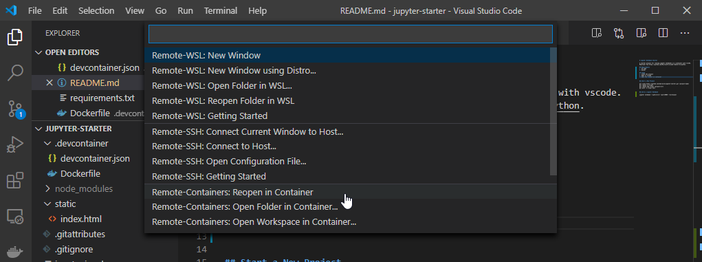

# Jupyter Notebook Starter

A starter project for running jupyter notebooks in a container with vscode. Modified from https://github.com/Microsoft/vscode-remote-try-python.

## Requirements
1. VS Code
2. Docker
3. [Remote Development vscode extension pack](https://marketplace.visualstudio.com/items?itemName=ms-vscode-remote.vscode-remote-extensionpack)

## Usage
1. Clone the project
2. Open in vscode
3. Open the project in container



## Start a New Project
```
git clone https://github.com/dmiracle/jupyter-starter.git <project-name>
git remote rm origin
git remote add origin <project-url>
git push -u origin main
```

## Serve a Jupyter Notebook
```
jupyter notebook --ip=0.0.0.0 --port=9099 --no-browser
```
Navigate to `localhost:9099` to find your notebook.